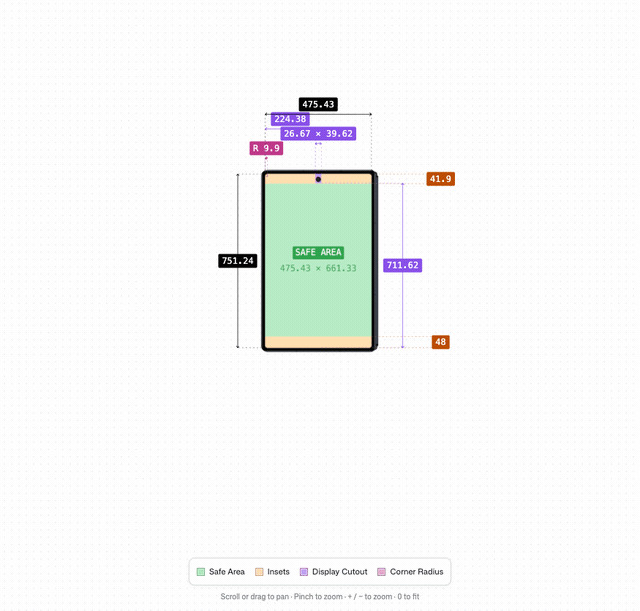
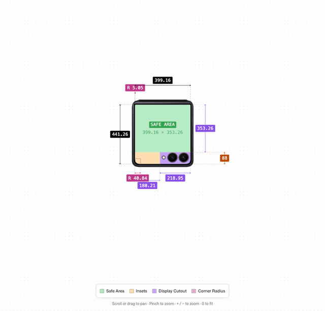
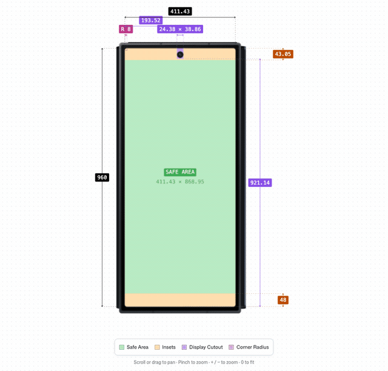

# windowinsets.info

Window insets, display cutouts, corner radii and foldable hinge states for Samsung Galaxy devices — with a source for every number.

Its interface is inspired by [safearea.info](https://safearea.info), adapted for measured Android data and Samsung foldables.

## Fold it. Measure it.

Explore Galaxy Fold, Flip and TriFold hinge states in **real-time 3D, built with Three.js and WebGL**. Rigid housings and articulated hinges show the folded depth, while official Samsung display artwork and exterior SVG rulers follow the fold.

| Galaxy Z Fold8 · book fold | Galaxy Z Flip8 · clamshell fold |
| :---: | :---: |
| [](https://windowinsets.info/galaxy-z-fold8) | [](https://windowinsets.info/galaxy-z-flip8) |

**0° → 180° → 0°** · Recorded from the live renderer with a fixed camera and zoom throughout the fold. Try the hinge slider, drag to pan, or pinch to zoom on [windowinsets.info](https://windowinsets.info).

**Galaxy Z TriFold · two-hinge fold**

[](https://windowinsets.info/galaxy-z-trifold)

The right hinge opens first, followed by the left; closing reverses that order. Camera and zoom stay fixed throughout.

The animation illustrates device geometry. Insets remain the recorded Android measurements for the selected cover or inner display; moving the hinge does not create new measurements.

## How I measure

The full write-up lives on the site at [/methodology](https://windowinsets.info/methodology) (source: [`app/routes/methodology.tsx`](app/routes/methodology.tsx)). In short:

- **Three source tiers.** Every value is `official` (published by Samsung/Google), `measured` (captured with InsetsProbe on a real device or Samsung Remote Test Lab, raw JSON committed here) or `community` (not yet reproduced). Each source shows the date it was checked.
- **Insets are measured, not published.** Samsung documents resolution and density, but not status/navigation bar heights, cutouts or corner radii, so I read them from Android itself with [InsetsProbe](tools/insets-probe).
- **Conditions are part of the data.** Portrait, full screen, default Display size / Font size / Screen resolution, one navigation mode (gesture or 3-button) per capture, and the One UI + Android version are all recorded. A value is only valid for those conditions.
- **Never estimated.** Nothing is interpolated from another device or derived from resolution alone. Unverified values are `null` and shown as **pending**.
- **Known limits.** One UI updates can change values; landscape and multi-window are not covered yet; a real app may see different insets if it adds its own padding or window flags.

Found a mistake or have a capture that differs from mine? Open an issue or pull request with your InsetsProbe JSON — a reproduction is as valuable as a new device.

## Measuring a device

Manufacturers don't publish insets, so I measure them with [InsetsProbe](tools/insets-probe) — a tiny Android app that dumps `WindowInsets`, `DisplayCutout`, `RoundedCorner`, `FoldingFeature` and the hinge angle as JSON. It works on a real device or on [Samsung Remote Test Lab](https://developer.samsung.com/remote-test-lab). See [tools/insets-probe/README.md](tools/insets-probe/README.md).

Put raw captures in `measurements/<device-slug>/<screen>-<navMode>.json` and reference them from the device's `Source` so anyone can re-check them.

## Camera cutouts and cover-screen limits

Android can report cover-screen cutout bounds through
[`DisplayCutout.getBoundingRects()`](https://developer.android.com/reference/android/view/DisplayCutout#getBoundingRects()).
The site shows width, height and all four distances to the captured window edges.
For example, the [verified Flip8 cover capture](measurements/galaxy-z-flip8/recapture-2026-09-23/cover-threeButton.json)
has one rectangle at `(428, 839)` sized **520 × 209 px**, inside a 948 × 1048 px window.
This covers the OS exclusion area, not separate measurements of each camera lens.

Android reports at most one bounding region per display edge. Lens diameter,
lens-to-lens spacing and physical camera identification cannot be recovered from
that combined rectangle alone. Do not estimate them from Samsung skin pixels.

[`getCutoutPath()`](https://developer.android.com/reference/android/view/DisplayCutout#getCutoutPath())
(API 31+) can provide finer OS contour geometry. InsetsProbe 1.3.0+ now records it
when available, using display-space px and `Path.approximate(0.25f)`. Existing
captures did not record it, so contour dimensions remain **pending recapture**.
Even a returned path is not a guarantee of separate physical lens outlines.
Missing old fields mean not collected; a new null path means not returned, not
zero geometry. Run the probe on the actual full-screen cover display: selecting
its label or rotating an inner-screen capture cannot measure the cover.
See the [site methodology](https://windowinsets.info/methodology#camera-cutouts).

## Device thickness and artwork limits

Samsung's [Galaxy Emulator Skin guide](https://developer.samsung.com/galaxy-emulator-skin/guide.html)
describes skins as the appearance and controls of an Android virtual device.
The Fold8 skin bundled here has flat `device.png` and `foreground.png` artwork;
its `layout` gives the screen rectangle and button positions, but no depth,
side profile or 3D mesh. The animated Fold8, Fold7 and Flip8 chassis now use
[Samsung Fold8](https://www.samsung.com/sec/smartphones/galaxy-z-fold8/specs/),
[Fold7](https://www.samsung.com/es/smartphones/galaxy-z-fold7/) and
[Flip8](https://www.samsung.com/sec/smartphones/galaxy-z-flip8/specs/) published
open-body widths and depths to scale the unfolded panel thickness. Samsung also
publishes folded thickness (9.7, 8.9 and 13.1 mm respectively), but the skin
does not specify hinge cross-section, side curvature or the gap at intermediate
angles. Those portions of the 3D fold remain illustrative, not a CAD-accurate
physical measurement.

## Stack

React, TypeScript and React Router (framework mode), styled with Tailwind CSS. Build-time prerendering (`ssr: false` + `prerender`) produces a static site.

- **Three.js + WebGL:** textured displays, a lit solid chassis, and continuous hinge geometry for both book and clamshell folds.
- **SVG measurement overlays:** display dimensions, safe-area insets, cutout bounds and corner radii projected from the same 3D transforms, with readable screen-space labels.
- **Synchronized interaction:** cover/inner metrics follow the rendered hinge angle; automatic fit, manual pan/zoom and reduced-motion support share the same view state.
- **Rendering fallback:** flat endpoint backing protects against transparent WebGL compositing; an SVG diagram remains available when the WebGL context fails.

Rendering lives in [`FoldRenderer3D.tsx`](app/components/FoldRenderer3D.tsx), [`foldGeometry.ts`](app/components/foldGeometry.ts) and [`ProjectedRulers.tsx`](app/components/ProjectedRulers.tsx). See [device thickness and artwork limits](#device-thickness-and-artwork-limits) for the boundary between published dimensions and illustrative geometry.

```bash
pnpm install
pnpm dev        # http://localhost:5173
pnpm typecheck
pnpm build      # prerendered HTML in build/client
```

## Device coverage and priorities

**Target coverage (WIP): every Samsung Galaxy model released in 2020 or later
with an official Galaxy Emulator Skin, plus all Galaxy Fold and Flip models with
official skins regardless of release year**, including discontinued models and
the Galaxy A and Note series. Discontinuation and flagship status are not exclusion
criteria. This supersedes the earlier no-cutoff decision. See [release evidence
and archive policy](docs/DEVICE_COVERAGE.md).

1. Improve the current Galaxy S, Z Fold and Z Flip experience.
2. Improve Galaxy Tab coverage.
3. Expand Galaxy Note and Galaxy A coverage; neither series takes priority over
   the other yet.

Galaxy Z TriFold support was approved separately on 2026-09-24: official
cover/inner artwork and a sequential two-hinge 3D animation are available. Its
main-display insets in both navigation modes and cover insets in both modes are
verified. See [TriFold scope](docs/REFERENCE_PARITY.md#trifold-support--2026-09-24).

An official skin permits an artwork preview, not a claim of verified inset data.
Devices without captures remain marked **Skin preview / pending** until measured.
Coverage is still in progress; this target is not a claim that every eligible
model has already been imported or measured.

### Galaxy Watch limitation

The Samsung Galaxy Emulator Skin downloads checked on 2026-09-25 contain no
Galaxy Watch skins. Galaxy Watch4 and later use Wear OS Powered by Samsung, so
Android `WindowInsets` can be measured, but the current InsetsProbe workflow and
device data model assume phone navigation modes (gesture or 3-button) and do not
represent watch-specific round-screen safe areas. Supporting Galaxy Watch needs
traceable watch artwork and a Wear OS measurement path that records those safe
areas separately. Until then, Galaxy Watch models are not part of the public
device catalogue, and no watch measurements are inferred from product images.
See [Galaxy Watch platform history](https://developer.samsung.com/galaxy-watch-tizen/notice.html)
and Android's [Wear OS screen-shape guidance](https://developer.android.com/training/wearables/views/layouts).

## Adding a device

1. To register downloaded skins, run `python3 scripts/import-samsung-skins.py /path/to/downloads`.
   The importer copies original artwork, registers main/cover screens in
   `app/data/skinCatalog.json`, including TriFold. Review each new model’s release
   year against the 2020 cutoff before publishing, except for Fold/Flip; record boundary/older models
   in `app/data/coverage.ts` with sources in `docs/DEVICE_COVERAGE.md`.
2. For RTL data, keep raw JSON in `measurements/<device-slug>/`, then create
   `app/data/devices/<slug>/index.ts` implementing `Device` (see `app/data/types.ts`).
3. Register that entry in `verifiedEntries` in `app/data/devices.ts` using the
   existing preview slug. Its screens override preview data; additional skin-only
   screens stay pending. Routes, sitemap and prerendering use the merged catalogue.

Current public catalogue: 119 models (29 S, 29 Tab, 9 Fold, 8 Flip, 1 TriFold,
3 Note, 40 A). The skin archive retains 126 models, including eight pre-2020 models.
New Fold/Flip entries have static main/cover previews where supplied; models
with a main skin also have hinge animation. Note/A artwork is available as static
previews; inset measurements remain pending.

## Development

See the [reference parity notes](docs/REFERENCE_PARITY.md) for design decisions and implementation details. Official Samsung artwork and layout coordinates are stored in `public/skins/` and `app/data/skins.ts`. Run geometry and asset tests with `node --test tests/rendering.test.mjs`.
